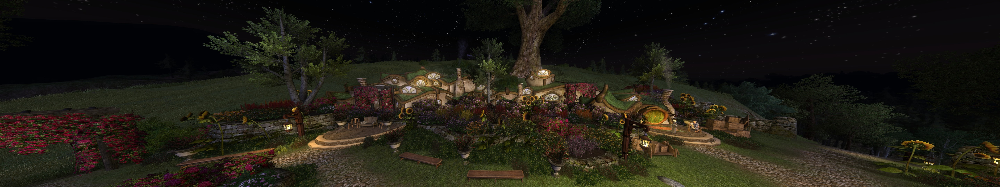

Screenshot: 5760 x 1080 @ 75° FOV

[![GitHub tag][shield_release]](https://github.com/pkurras/durinvi/releases)
[![GitHub issues][shield_issue]](https://github.com/pkurras/durinvi/issues)

# Lord of the Rings Online - Durin VI Edition
This project contains the binaries for Lord of the Rings Online - Durin VI Edition. This project aims to extend the game with - for other players - non-interfering features, that are still missing from the game options.
## Important Note
Use this software at your own risk. This **HACK** is actually classified as a prohibited tool. **HACKING ACCOUNTS** tend to get banned over time since they violate the terms of service.
However, if you still want to use this **HACK**, I will take no responsibility for the possible consequences. As of today, `Standing Stone Games` has not taken any actions against this project and **HACKS** outside the spectrum of bots and the likes. An [official response](https://www.lotro.com/forums/showthread.php?684404-motion-sickness-FOV-and-a-question-for-SSG&p=8045778#post8045778) once said that there is a chance that the devs would not take action against projects like this as long as the provided features are NOT used to get an advantage over other players. **BE WARNED! THAT STATEMENT MIGHT NOT HOLD TRUE IN THE FUTURE!**
## Usage
### Do this once
1. In the LOTRO Launcher by SSG go to Options
2. Change the game client to 64-bit
3. Download the current release from [here](https://github.com/pkurras/durinvi/releases)
4. Extract the *.zip archive to wherever you like
### Do this everytime
1. Start the game as usual
2. Start the `launcher.exe` that is part of this project
## Keybindings
Please unbind all actions from the Numpad on your keyboard as this project uses these keys for its own actions.
* **F1** Reverts all changes and unloads the program
* **NUMPAD ADD** Increases the field of view
* **NUMPAD SUBTRACT** Decreases the field of view
## Features
### General Features
* Launcher for injection
* Patternscan for valid offsets
### Reverse engineered features
* Custom field of view

[shield_release]: https://img.shields.io/github/v/release/pkurras/durinvi?color=green&include_prereleases&style=for-the-badge
[shield_issue]: https://img.shields.io/github/issues-raw/pkurras/durinvi?style=for-the-badge
